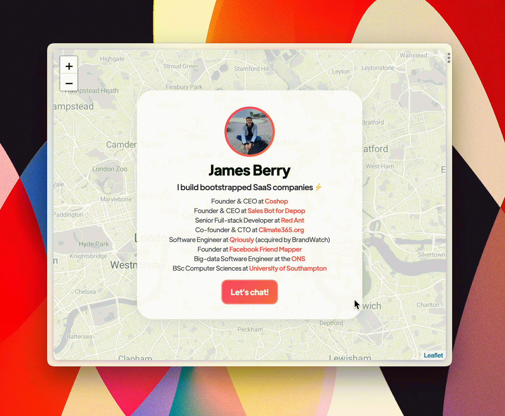

  <h1>Copy Mailto</h1>
  
   
  

## **No more default mail app** 🧩

- Copy email and telephone links to your clipboard.
- Web extension support for Chrome, Firefox, Edge, Brave & Opera.
- Free and open source.

## Getting started

1. Install the extension.
2. Profit 🤑

